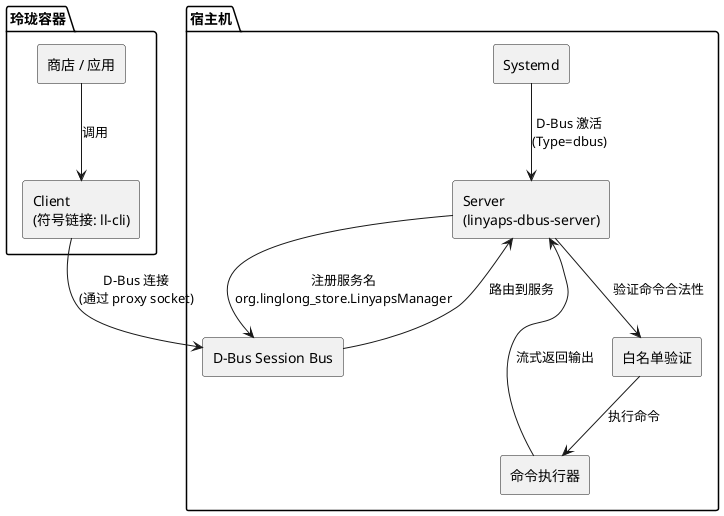
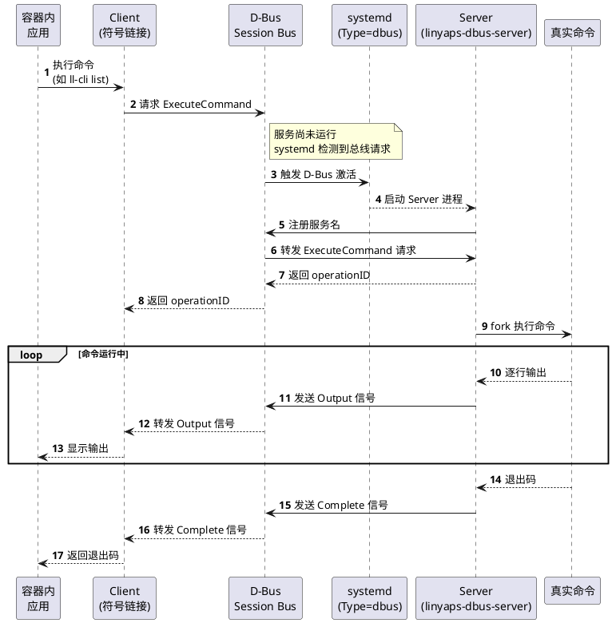
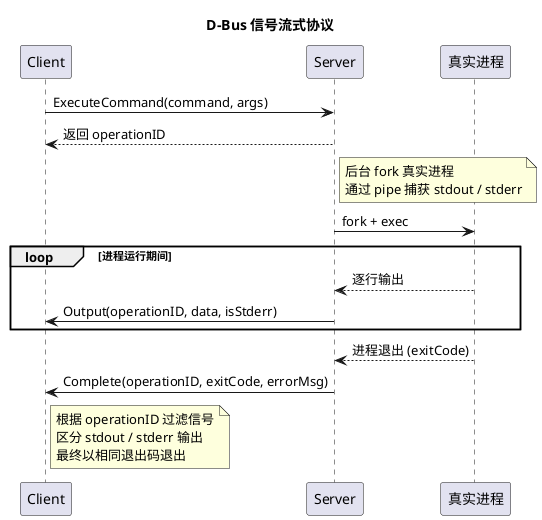
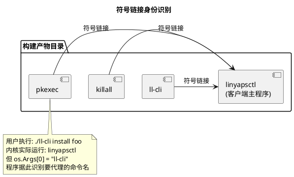
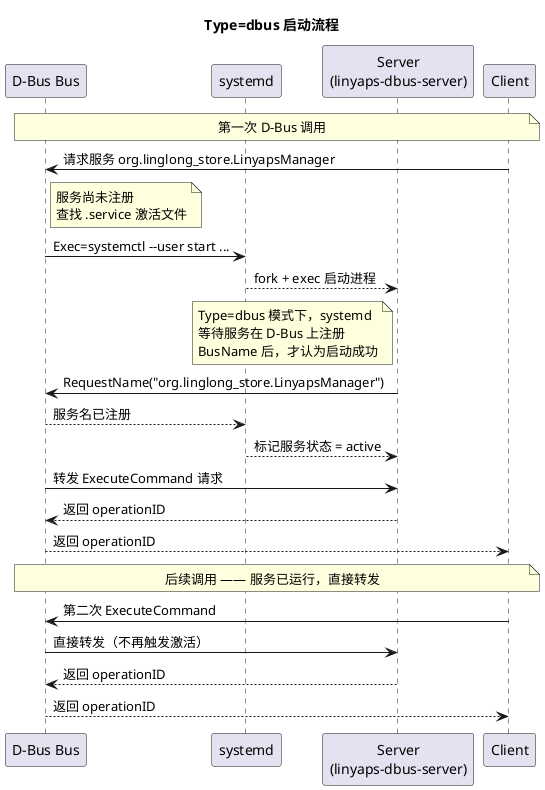
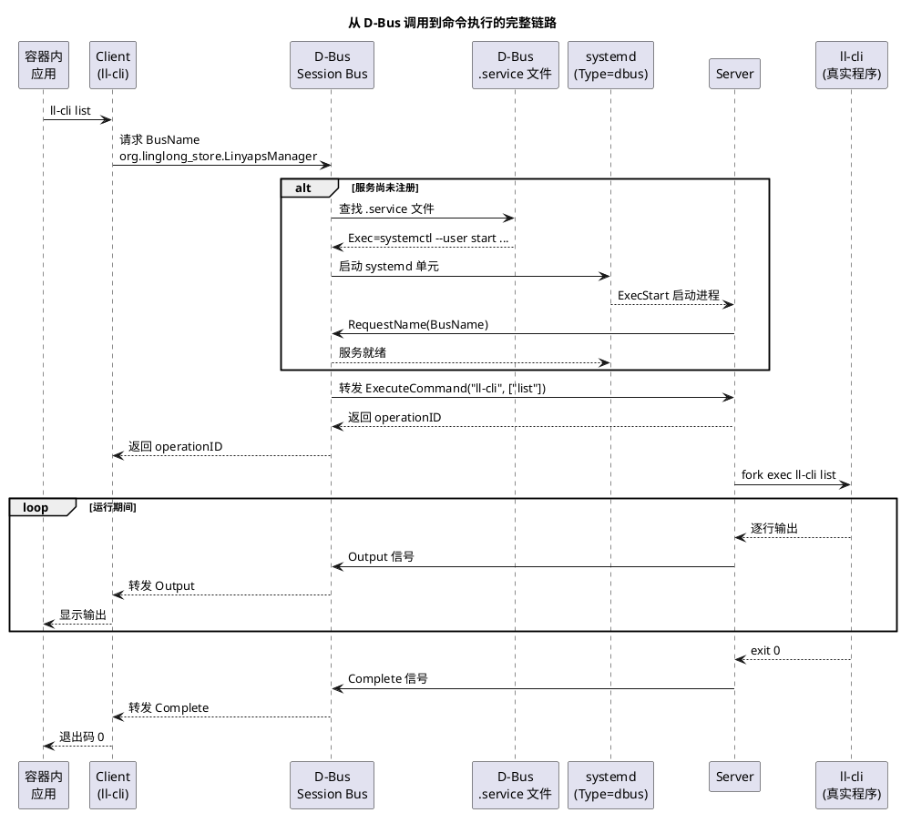
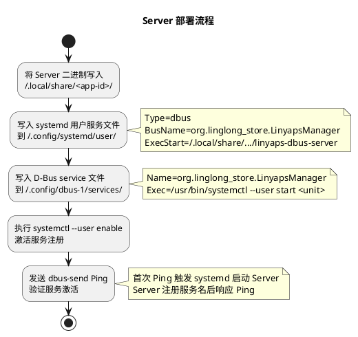
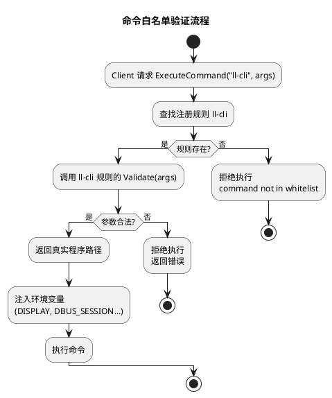
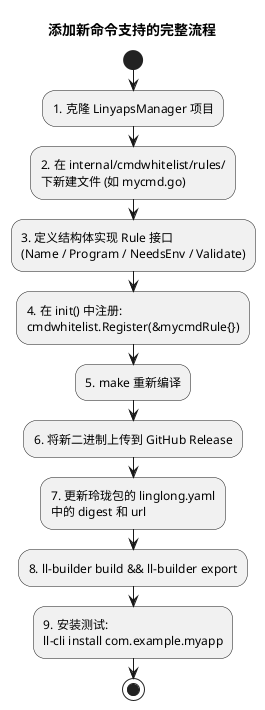
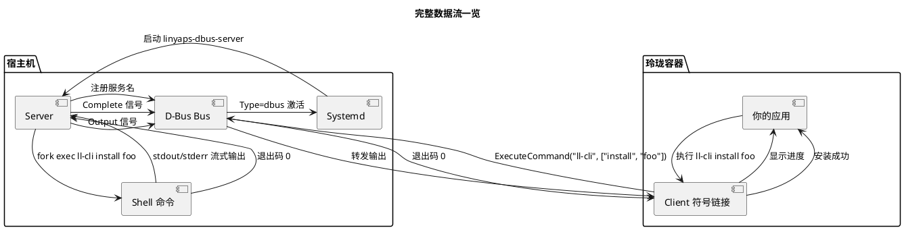

# 玲珑容器内调用宿主机 Shell：基于 D-Bus 的透明代理方案

目前玲珑容器内是没有调用宿主机 Shell 的官方方法的，但是开发基于tauri的玲珑商店社区版2.0的时候，由于tauri2.0对glibc要求比较高，所以没办法在一些比较老的Linux发行版上运行，于是打算使用玲珑包解决glibc问题，但是又遇到了没办法调用宿主机的`ll-cli`的问题，所以研究出来了本方案。
因为tauri仍然有一些webview兼容性问题，甚至不同发行版里面的样式都有细微的差别或者是bug，所以换flutter方案了，于是就有了[玲珑商店社区版3.0](https://github.com/HanHan666666/flutter-linglong-store)（bug即将改完的阶段），虽然tauri的商店2.0被放弃了，但是这个方案还是有一些意义的，在官方发布官方方法之前。

但是根据目前玲珑的机制，可以自己实现这个功能——而且不需要修改 linyaps 源码，玲珑安装包直接安装好就可以调用。

原理大致是：在容器外启动一个服务（Server），监听容器内（Client）的请求，代理容器在宿主机执行命令，然后把命令的输出返回给容器内的程序。这样容器内就能达到执行 Shell 的目的。

这个事情最关键的问题就是**如何把 Server 启动起来**——解决了这个问题，其他的问题就迎刃而解了。

众所周知，玲珑的 home 目录容器内外是相通的。既然 home 是通的，那就可以写入用户 systemd 和 D-Bus 配置，然后利用 **D-Bus 唤醒机制** 唤醒玲珑容器自带的 systemd 服务。

下面以[玲珑商店社区版2.0](https://github.com/SXFreell/linglong-store)介绍这个 Server 和 Client 的实现。

**声明：下面是AI写的，不过所有的内容都由本人审计过。**

## C/S 架构设计

整个方案采用 **C/S 架构**，容器内的程序作为 Client，通过 D-Bus 向容器外的 Server 发起命令执行请求。

源码：[https://github.com/guanzi008/org.linglong-store.LinyapsManager](https://github.com/guanzi008/org.linglong-store.LinyapsManager)

### 整体架构



### 激活流程

Server 不需要常驻后台。核心机制是 **systemd + D-Bus 联动激活**：



### 流式传输协议

D-Bus 方法调用是同步的，长时间运行的命令会阻塞连接。所以采用 **operationID + 信号** 的异步模式：



### Client 身份识别

Client 采用**一个二进制、多个符号链接**的方案：



用户完全感知不到中间层——输入的是 `ll-cli install foo`，退出的也是 `ll-cli` 的退出码，体验是透明的。

## 如何部署：把 Server 启动起来

这是整个方案最关键的一步。核心思路：**利用玲珑容器的 home 目录共享特性，在容器内写入宿主机可识别的 systemd 和 D-Bus 配置**。

### 原理

玲珑容器的 home 目录与宿主机 home 是同一个目录。因此容器内可以写入以下文件到 `~/.config` 下：

| 文件路径 | 作用 |
|------|------|
| `~/.config/systemd/user/*.service` | systemd 用户服务定义 |
| `~/.config/dbus-1/services/*.service` | D-Bus 服务激活文件 |

systemd 服务配置为 `Type=dbus`，当第一次 D-Bus 调用到达时，systemd 自动启动 Server 进程，Server 注册服务名后 systemd 标记服务就绪。后续调用直接复用已有的 Server。

### systemd + D-Bus 按需唤醒详解

这是整个方案最核心的部分——**Server 不需要常驻后台，而是由第一次 D-Bus 调用自动拉起来**。下面拆解这套机制是如何配置的。

#### 为什么需要按需唤醒？

玲珑包安装到用户系统后，Server 二进制被放到了用户目录下，但**用户安装玲珑包时没有任何手段让服务自动开机自启**——没有 root 权限，没有 systemd preset 机制，也没有安装后 hook。

摆在面前的路只有一条：**容器内无法直接启动任何宿主机服务**——玲珑容器里不能执行宿主机命令。容器内唯一能做的就是往 home 目录写文件（因为玲珑的 home 目录容器内外是相通的）。

所以唯一的办法就是：**在容器内把 D-Bus 激活配置写到 home 下，让第一次 D-Bus 调用从宿主机侧把服务拉起来**。用户装完包直接就能用，完全不需要（也不可能）在容器内手动启服务。

#### 两个配置文件的作用

按需唤醒需要配合两个文件：

```
~/.config/
├── systemd/user/
│   └── com.dongpl.linglong-store.v2.service   ← systemd 服务定义
└── dbus-1/services/
    └── org.linglong_store.LinyapsManager.service  ← D-Bus 激活配置
```

**D-Bus service 文件**（`org.linglong_store.LinyapsManager.service`）告诉 D-Bus：当有人请求 `org.linglong_store.LinyapsManager` 这个服务名但服务还没注册时，应该执行什么命令来启动它：

```ini
[D-BUS Service]
Name=org.linglong_store.LinyapsManager
Exec=/usr/bin/systemctl --user start com.dongpl.linglong-store.v2.service
```

- `Name` 必须是和 Server 要注册的 D-Bus 服务名完全一致
- `Exec` 不是直接启动 Server，而是交给 systemd 管理。这样做的好处是 systemd 可以处理重启、依赖、状态查询等

**systemd 服务文件**（`com.dongpl.linglong-store.v2.service`）定义 Server 如何运行：

```ini
[Unit]
Description=LinyapsManager DBus Server

[Service]
Type=dbus
BusName=org.linglong_store.LinyapsManager
ExecStart=/home/user/.local/share/com.dongpl.linglong-store.v2/linyaps-dbus-server
Restart=on-failure
RestartSec=3

[Install]
WantedBy=default.target
```

其中最关键的一行是 **`Type=dbus`**。

#### Type=dbus 的工作原理

systemd 的 `Type=dbus` 是专为 D-Bus 服务设计的启动类型，它的行为和普通 `Type=simple` 有本质区别：



`Type=dbus` 的核心逻辑：

1. systemd 启动 Server 进程后，**不会立即标记服务为 active**
2. systemd 会监视 D-Bus，等待有进程注册 `BusName=` 指定的名字
3. 一旦 Server 在代码中调用 `conn.RequestName("org.linglong_store.LinyapsManager")`，D-Bus 通知 systemd，systemd 标记服务启动成功
4. 如果 Server 超时未注册服务名，systemd 会判定启动失败并触发 `Restart=on-failure`

这保证了 D-Bus 调用方拿到的永远是一个已经就绪的服务——不会出现"systemd 说服务启动了，但 Server 还没注册 D-Bus 名字"的竞态。

#### 对应的 Go 代码

Server 端的关键启动代码：

```go
// 1. 连接 D-Bus
conn := dbusutil.Connect("")

// 2. 抢占服务名 —— 这一步会通知 systemd "服务已就绪"
conn.RequestName(dbusconsts.BusName, dbus.NameFlagDoNotQueue)

// NameFlagDoNotQueue 的含义：
//   如果服务名已经被其他实例占用，直接报错而不是排队等待
//   这防止了同一个服务被意外启动多个实例
```

`NameFlagDoNotQueue` 是一个安全机制——如果用户手动启动了一个 Server 实例，systemd 又尝试拉起第二个，第二个会因为这个名字已被占用而立即退出。

#### 完整调用链路回顾



#### 部署流程



### 安全机制：命令白名单

并非任意命令都能被代理执行。Server 内置了一套**可插拔的规则系统**，每个命令一个规则文件，通过 `init()` 函数自动注册：



特别值得注意的是 `pkexec` 规则——它实现了**递归验证**：当用户调用 `pkexec ll-cli install foo` 时，pkexec 规则提取嵌套的 `ll-cli` 命令，委托给 ll-cli 规则做二次验证。`pkexec rm -rf /` 被直接拒绝，而 `pkexec ll-cli install foo` 则可以通过。

## 快速搭建：构建一个能调用宿主机 Shell 的玲珑包

以 [linglong-store-linyaps-build](https://github.com/HanHan666666/linglong-store-linyaps-build) 为例，这个包需要用到 `ll-cli` 命令。

### 第一步：创建玲珑包目录

```
my-shell-app/
├── linglong.yaml           # 玲珑构建配置
├── rebuild.sh              # 一键构建脚本
└── resources/
    └── usr/
        └── bin/
            └── setup.sh    # 入口脚本
```

### 第二步：编写 linglong.yaml

以 `linglong-store-linyaps-build` 的实际配置为例：

```yaml
version: "1"

package:
  id: com.dongpl.linglong-store.v2
  name: linglong-store
  version: 3.3.6.1
  kind: app
  architecture: x86_64
  description: 用于发现和管理玲珑应用的玲珑商店社区版。

# 容器启动时执行的入口脚本
command:
  - /opt/apps/com.dongpl.linglong-store.v2/files/bin/setup-linyaps-dbus.sh

base: org.deepin.base/25.2.2

build: |
  # 构建阶段：将二进制安装到容器文件系统
  install -Dm755 /project/linglong/sources/linyaps-dbus-server ${PREFIX}/bin/linyaps-dbus-server
  install -Dm755 /project/linglong/sources/linyapsctl ${PREFIX}/bin/ll-cli
  install -Dm755 /project/linglong/sources/linyapsctl ${PREFIX}/bin/pkexec
  cp -a /project/resources/usr/* ${PREFIX}

sources:
  # 你的应用前端（如 Flutter 编译产物）
  - kind: file
    url: https://github.com/HanHan666666/flutter-linglong-store/releases/download/v3.3.6/linglong-store_3.3.6_amd64.deb
    digest: f03d42c00a6bcc85a4a38d6f525fd1d536faaeabc264f8ca1f3a9c1282af468b
    name: linglong-store

  # Server 端 —— 从 LinyapsManager 项目的 Release 下载
  - kind: file
    url: https://github.com/guanzi008/org.linglong-store.LinyapsManager/releases/download/v0.0.8/linyaps-dbus-server-linux-amd64
    digest: cd19236fabcd95bf9713e98cc266a579844db8ed144ae03897e6bdc809e9c80e
    name: linyaps-dbus-server

  # Client 端 —— 同一个项目的另一个 Release 文件
  # 注意：这里将 linyapsctl 重命名为了 ll-cli，这样在容器内安装后，
  # 用户调用 ll-cli 时实际运行的是 linyapsctl，它通过 os.Args[0] 识别命令
  - kind: file
    url: https://github.com/guanzi008/org.linglong-store.LinyapsManager/releases/download/v0.0.8/linyapsctl-linux-amd64
    digest: 1e554071518e7d9a7c7a0d63a22e523da93bdd6a4dd3aca41bb3d5c63d5bca42
    name: linyapsctl
```

关键点：

- `sources` 中的 `name` 字段是下载后的文件名，`build` 阶段的 `install` 命令决定了安装到容器内的**最终名字**
- 要让容器内调用 `ll-cli`，就在 `build` 阶段把 `linyapsctl` 安装为 `ll-cli`
- 需要支持多个命令时，分别安装多次即可（如上面的 `ll-cli` 和 `pkexec`）

### 第三步：编写入口脚本

`resources/usr/bin/setup-linyaps-dbus.sh` 负责两件事：**部署 Server、启动应用**。

```bash
#!/bin/bash
SERVER_DIR="$HOME/.local/share/com.dongpl.linglong-store.v2"
SERVER_BIN="$SERVER_DIR/linyaps-dbus-server"
UNIT_NAME="com.dongpl.linglong-store.v2.service"
SERVICE_NAME="org.linglong_store.LinyapsManager.service"

# 1. 版本检查 —— 如果版本变化，先停止旧服务
VERSION_FILE="$SERVER_DIR/.version"
NEW_VERSION="3.3.6.1"
if [ -f "$VERSION_FILE" ] && [ "$(cat "$VERSION_FILE")" != "$NEW_VERSION" ]; then
    dbus-send --session \
      --dest=org.linglong_store.LinyapsManager \
      --type=method_call \
      /org/linglong_store/LinyapsManager \
      org.linglong_store.LinyapsManager.Quit 2>/dev/null || true
    systemctl --user stop "$UNIT_NAME" 2>/dev/null || true
fi

# 2. 部署 Server 二进制
mkdir -p "$SERVER_DIR"
cp /usr/bin/linyaps-dbus-server "$SERVER_BIN"
chmod +x "$SERVER_BIN"
echo "$NEW_VERSION" > "$VERSION_FILE"

# 3. 写入 systemd 用户服务
mkdir -p "$HOME/.config/systemd/user"
cat > "$HOME/.config/systemd/user/$UNIT_NAME" <<EOF
[Unit]
Description=LinyapsManager DBus Server

[Service]
Type=dbus
BusName=org.linglong_store.LinyapsManager
ExecStart=$SERVER_BIN
Restart=on-failure
RestartSec=3

[Install]
WantedBy=default.target
EOF

# 4. 写入 D-Bus service 文件
mkdir -p "$HOME/.config/dbus-1/services"
cat > "$HOME/.config/dbus-1/services/$SERVICE_NAME" <<EOF
[D-BUS Service]
Name=org.linglong_store.LinyapsManager
Exec=/usr/bin/systemctl --user start $UNIT_NAME
EOF

# 5. 激活服务（首次调用触发 systemd 启动 Server）
dbus-send --session \
  --dest=org.linglong_store.LinyapsManager \
  --type=method_call \
  --print-reply \
  /org/linglong_store/LinyapsManager \
  org.linglong_store.LinyapsManager.Ping

# 6. 启动应用
exec /usr/bin/linglong-store
```

### 第四步：构建

```bash
ll-builder build
ll-builder export
```

### 第五步：安装运行

```bash
ll-cli install com.dongpl.linglong-store.v2
# 从玲珑菜单启动
```

---

## 添加新命令支持：编写 Rules

LinyapsManager 使用**可插拔的规则系统**——每个命令一个规则文件，通过 `init()` 自动注册。要添加新命令，需要：

1. 克隆 `org.linglong-store.LinyapsManager` 项目
2. 在 `internal/cmdwhitelist/rules/` 下新建规则文件
3. 重新编译，替换 Release 中的二进制

### Rule 接口

```go
type Rule interface {
    Name() string                                    // 命令名，如 "ll-cli"
    Program() string                                 // 实际可执行路径
    NeedsEnv() bool                                  // 是否需要注入会话环境变量
    Validate(args []string) ([]string, error)        // 参数验证
}
```

### 示例 1：最简单的规则 —— killall

文件：`internal/cmdwhitelist/rules/killall.go`

```go
package rules

import (
    "fmt"
    "linyapsmanager/internal/cmdwhitelist"
)

func init() {
    cmdwhitelist.Register(&killallRule{})
}

type killallRule struct{}

func (r *killallRule) Name() string    { return "killall" }
func (r *killallRule) Program() string { return "/usr/bin/killall" }
func (r *killallRule) NeedsEnv() bool  { return false }

func (r *killallRule) Validate(args []string) ([]string, error) {
    if len(args) == 0 {
        return nil, fmt.Errorf("killall requires arguments")
    }
    // 只允许 kill 特定的进程名
    allowedTargets := map[string]bool{"ll-cli": true}
    target := args[len(args)-1]
    if !allowedTargets[target] {
        return nil, fmt.Errorf("process %q is not allowed", target)
    }
    return args, nil
}
```

### 示例 2：复杂规则 —— ll-cli（子命令白名单 + 全局标志）

文件：`internal/cmdwhitelist/rules/llcli.go`

```go
package rules

import (
    "fmt"
    "strings"
    "linyapsmanager/internal/cmdwhitelist"
)

func init() {
    cmdwhitelist.Register(&llcliRule{})
}

type llcliRule struct{}

func (r *llcliRule) Name() string    { return "ll-cli" }
func (r *llcliRule) Program() string { return "ll-cli" }  // PATH 查找
func (r *llcliRule) NeedsEnv() bool  { return true }      // 需要 DISPLAY 等会话环境

var llcliAllowedSubcmds = map[string]bool{
    "list": true, "search": true, "info": true,
    "install": true, "uninstall": true, "run": true,
    // ... 更多子命令
}

var llcliCommonFlags = map[string]bool{
    "--json": true, "--verbose": true, "--debug": true,
}

func (r *llcliRule) Validate(args []string) ([]string, error) {
    if len(args) > 20 {
        return nil, fmt.Errorf("too many arguments: max 20")
    }
    if len(args) == 0 {
        return args, nil
    }
    // 找到第一个非全局标志的参数，即子命令
    for _, arg := range args {
        if llcliCommonFlags[arg] {
            continue
        }
        if strings.HasPrefix(arg, "-") {
            continue  // 未知标志，跳过（由 ll-cli 自身验证）
        }
        if !llcliAllowedSubcmds[arg] {
            return nil, fmt.Errorf("subcommand %q is not allowed", arg)
        }
        break
    }
    return args, nil
}
```

### 示例 3：递归验证 —— pkexec

文件：`internal/cmdwhitelist/rules/pkexec.go`

```go
package rules

import (
    "fmt"
    "linyapsmanager/internal/cmdwhitelist"
)

func init() {
    cmdwhitelist.Register(&pkexecRule{})
}

type pkexecRule struct{}

func (r *pkexecRule) Name() string    { return "pkexec" }
func (r *pkexecRule) Program() string { return "/usr/bin/pkexec" }
func (r *pkexecRule) NeedsEnv() bool  { return false }

func (r *pkexecRule) Validate(args []string) ([]string, error) {
    if len(args) == 0 {
        return nil, fmt.Errorf("pkexec requires arguments")
    }
    // pkexec 的第一个参数是要执行的命令
    nestedCmd := args[0]
    rule := cmdwhitelist.GetRule(nestedCmd)
    if rule == nil {
        return nil, fmt.Errorf("nested command %q is not allowed", nestedCmd)
    }
    // 委托给嵌套命令的规则验证剩余参数
    validatedArgs, err := rule.Validate(args[1:])
    if err != nil {
        return nil, err
    }
    return validatedArgs, nil
}
```

### 添加自定义命令的完整流程



### 编写规则的要点清单

| 事项 | 说明 |
|------|------|
| `Name()` | 必须和符号链接名字一致（如 `"ll-cli"`） |
| `Program()` | 返回真实路径，可以是 PATH 中的名字或绝对路径 |
| `NeedsEnv()` | 需要 DISPLAY/WAYLAND 等 GUI 环境的设为 `true` |
| `Validate()` | 白名单验证：只允许明确的子命令/参数组合 |
| 参数限制 | 设置最大参数数量，防止注入攻击 |
| 危险参数 | 显式 block 如 `-u`, `--user`, `-9` 等危险参数 |
| 注册 | 必须在 `init()` 中调用 `cmdwhitelist.Register()` |
| 编译 | 每次修改后必须重新 `make` 编译 |

## 完整数据流



## 总结

整个方案不需要修改 linyaps 源码，安装包装好后就能用。核心要点就三个：

1. **home 目录共享** → 容器内外写入同一份配置
2. **D-Bus + systemd 联动** → 按需唤醒，不常驻后台
3. **符号链接身份** → 用户体验零感知

---

AI写代码现在是真的快，有明确业务逻辑的情况下，几天就能搞出来完整功能的雏形。

向本方案提出人致谢：[@罐子](https://bbs.deepin.org.cn/user/318667)
